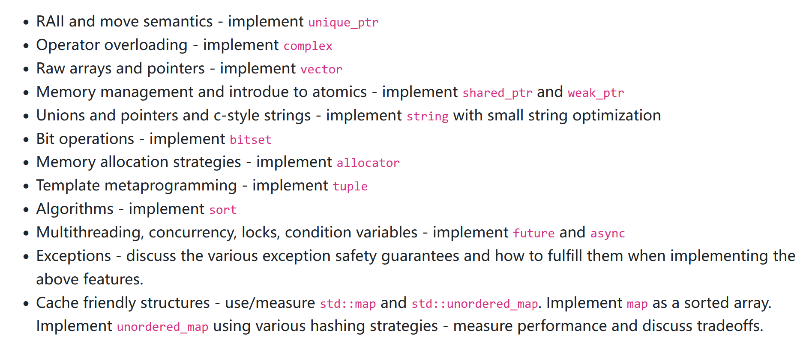

### thestl: my tiny stl

## targets

## done
- [x] unique_ptr
- [x] complex
- [x] vector
- [x] weak_ptr
- [x] string
- [x] bitset
- [x] allocator
- [ ] tuple
- [ ] sort
- [ ] future and async
- [ ] exception
- [ ] map and unordered_map